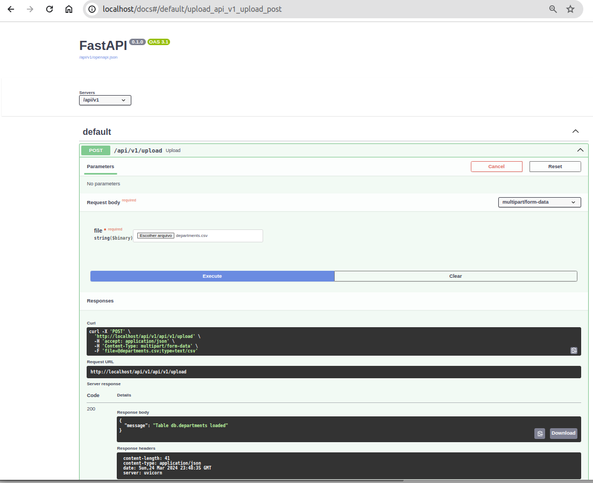

# globant-test-DE
Data Engeneer Test <br>
This project creates tables and them call API to load data into database (mariadb) <br>
using native database LOAD command usin client  , to read CSV and load at the database <br>
chosen to allow fast load , proved on small and big files even using database constraints .<br>
python FastAPI and uvicorn frameworks to allow create API , document and run requests 

Project Directories  

- ## data 
   Contains CSV files and pdf instructions <br>
   Note . link on pdf not works then I created  CSVs at hand following examples in pdf .  
- ## mariadb 
   Docker-compose database install 
- ## FastAPI
   python framework to allow create API  
- ## scripts 
   sql scripts and shell scripts
- ## python-flask  ( NOT IN USE ) 
   web environment to upload file and database load  
# Clone project on linux apt environment and follow the steps below 
# Steps to install mariadb (docker-compose) port 3306 
```bash
cd mariadb
# install client 
linux-install-mysql-client.sh
# Start mariadb in bg docker-compose run 
run.sh &
cd ..
```
# Start FastAPI
```bash
cd FastAPI
# install python requirement.txt 
./install_requirements.sh
uvicornctl start
cd ..
```
# Create database tables using DDL.sql
```bash
cd scripts 
./create_tables.sh
```
# Load tables using scripts 
```bash
./load_table.sh ../data db departments
./load_table.sh ../data db jobs
./load_table.sh ../data db hired_employees
```
# Client to POST file and Load table using API (using curl) 
```bash
curl -X 'POST' \<br>
  'http://localhost:9000/upload' \
  -H 'accept: application/json' \
  -H 'Content-Type: multipart/form-data' \
  -F 'file=@jobs.csv;type=text/csv'
```
# OR Using  web browser GUI FastAPI /docs
upload the CSV files<br>
http://localhost:9000/docs<br>

# Run queries 
```bash
run_queries.sh
```
# output
```bash

run query 1
+-------------+-----------+---------+---------+---------+---------+
| department  | job       | sum(q1) | sum(q2) | sum(q3) | sum(q4) |
+-------------+-----------+---------+---------+---------+---------+
| Staff       | Recruiter |       3 |       0 |       7 |      11 |
| Staff       | Manager   |       2 |       1 |       0 |       2 |
| Suppy Chain | Manager   |       0 |       1 |       3 |       0 |
+-------------+-----------+---------+---------+---------+---------+

run query 2
+---------------+------------+-------+---------+
| department_id | department | hired | mean    |
+---------------+------------+-------+---------+
|             7 | Staff      |    26 | 15.0000 |
+---------------+------------+-------+---------+
```


